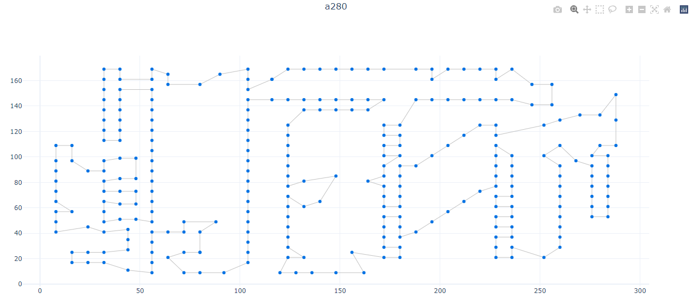

# Lin-Kernighan Heuristic in Python

This package contains the implementation of *Lin-Kernighan Heuristic* as the main solver for Travelling Salesman Problem (**TSP**) instances. 

## Implementation Remarks

### LK and LKH

LK Heuristic was first reported in an [1973 article][lk_article], where the core basis of the algorithm is well explained and detailed. A few decades later, in an [1998 article][lkh_article], Keld Helsgaun reported some enhancements to the original LK Heuristic (the famous [LKH heuristic][lkh]) with additional technical details for implementing the LK heuristic.

Both of these articles were the foundation for the implementation of the algorithm included in this package, with additional inspiration from [Arthur Mahéo post][arthur] / python implementation (which I strongly recommend the reading!).

### Node Structure

Nodes are implemented as Doubly-Linked Lists, one of the structures mentioned by Helsgaun to speed up edge swap operations. More advanced structures can be implemented for faster swaps, but are not included in this package.

### Refinements

There are 4 refinements proposed in the 1973 article aiming to improve the algorithm performance. Items 1 and 2 in the list below were implemented in this package, while items 3 and 4 are still open for implementation.

 1. Avoid checkout time (by skipping repeated 'bad' tours).
 2. Lookahead (by selecting 'good' edges for swaps)
 3. Reduction (by keeping 'good' edges from being broken)
 4. Non-Sequential exchanges (by allowing exchanges that does not form a tour)
 
## How-to-use

### TSPLIB

The use of this package is based on [.tsp files][tsplib] as the input to the improve procedure and also as the output (with the difference that nodes will be sorted at output file). Currently the .tsp files supported are *"TYPE: TSP"* (i.e, symmetric problem) and *"EDGE_WEIGHT_TYPE: EUC_2D / EUC_3D"* (euclidean distance in 2D or 3D), with no "special" sections in .tsp file. 

### Solvers

The package contains 3 possible solvers for the TSP problem, which can be selected during interactive mode or silent mode:

  1. **Brute-Force**: test all tour possibilities (this should be used for very small problems)
  2. **Nearest-Neighbor**: collect nearest nodes starting from a random node (fast, but non-optimal)
  3. **Lin-Kernighan**: The main algorithm of the package 

Methods 1 and 2 were implemented mostly for testing reasons and some performance comparisons, so the recommended solver is Lin-Kernighan.

### Interactive Mode

To run the solver in interactive mode, follow these steps:

  1. Add the desired .tsp file in 'samples' folder.
  2. Run tsp_interactive_solver.py file (`python tsp_interactive_solver.py`).
  3. Enter the number of the tsp file to be used
  4. Enter the number of the solution method to be used 
  5. After improve has finished, a .tsp file is exported at 'solutions' folder

### Silent Mode

To run the solver in silent mode, follow these steps:

  1. Run tsp_silent_solver.py file with the following args: --tsp_file: the path to .tsp file --solution_method: one of the possible solvers ('bf_improve', 'nn_improve', 'lk_improve').
  2. After improve has finished, a .tsp file is exported at 'solutions' folder

Example: 
  `python tsp_silent_solver.py --tsp_file "C:/temp/test.tsp" --solution_method "lk_improve"`

### Example of an interactive run 

```
# Step 1 - TSP Instance Selection #
*TSP instances available in 'samples' directory:
[0] - a280.tsp
[1] - hexagon_2d.tsp
[2] - hexagon_3d.tsp
--> Select one of the instances: 2

# Step 2 - TSP Solution Methods #
*TSP solution methods available in tsp.py:
[0] - bf_improve
[1] - nn_improve
[2] - lk_improve
--> Select one of the solution methods: 2

2022-01-26 21:10:26,674 [INFO] utils.solver_funcs: Importing .tsp file 'hexagon_3d.tsp'
2022-01-26 21:10:26,676 [INFO] utils.solver_funcs: Using 'cost_func_3d' for edge type 'EUC_3D'
2022-01-26 21:10:26,676 [INFO] utils.solver_funcs: Creating TSP instance
2022-01-26 21:10:26,678 [INFO] utils.solver_funcs: Starting improve method
2022-01-26 21:10:26,678 [INFO] models.tsp: Current tour '1' cost: 26.938
2022-01-26 21:10:26,680 [INFO] models.tsp: Current tour '2' cost: 23.399
2022-01-26 21:10:26,681 [INFO] models.tsp: Current tour '3' cost: 21.694
2022-01-26 21:10:26,682 [INFO] models.tsp: Current tour '4' cost: 18.131
2022-01-26 21:10:26,683 [INFO] models.tsp: Current tour '5' cost: 16.330
2022-01-26 21:10:26,683 [INFO] models.tsp: Current tour '6' cost: 15.750
2022-01-26 21:10:26,684 [INFO] models.tsp: Current tour '7' cost: 14.132
2022-01-26 21:10:26,686 [INFO] models.tsp: Current tour '8' cost: 14.030
2022-01-26 21:10:26,687 [INFO] models.tsp: Current tour '9' cost: 11.061
2022-01-26 21:10:26,689 [INFO] models.tsp: Current tour '10' cost: 9.778
2022-01-26 21:10:26,693 [INFO] models.tsp: Current tour '11' cost: 9.778
2022-01-26 21:10:26,694 [INFO] utils.timer_funcs: Finished 'lk_improve' function with best cost '9.778' found in 0.015 seconds   
2022-01-26 21:10:26,697 [INFO] utils.solver_funcs: Exporting 'hexagon_3d_9.778.tsp' file to solutions folder
```

## Plotting

The main output from the improvement process is the .tsp file with nodes sorted as in the optimal tour found at improvement procedure. User can use this file and parse it to his preferred visualization tool. Although, a simple tool was designed to display 2D and 3D plots using [Plotly][plotly].

In plot_funcs.py, there are two functions to plot either 2D or 3D graphs using as input the .tsp file. After running those functions, a html file is exported at 'plots' folder, which can be viewed using the browser.

Example of the plot result using a280.tsp instance


## Packages and Versions

Python: 3.7.0 64bit

[lk_article]: https://doi.org/10.1287%2Fopre.21.2.498
[lkh_article]: https://doi.org/10.1016%2FS0377-2217%2899%2900284-2
[lkh]: http://webhotel4.ruc.dk/~keld/research/LKH/
[arthur]: https://arthur.maheo.net/implementing-lin-kernighan-in-python/
[tsplib]: http://comopt.ifi.uni-heidelberg.de/software/TSPLIB95/
[plotly]: https://plotly.com/python/